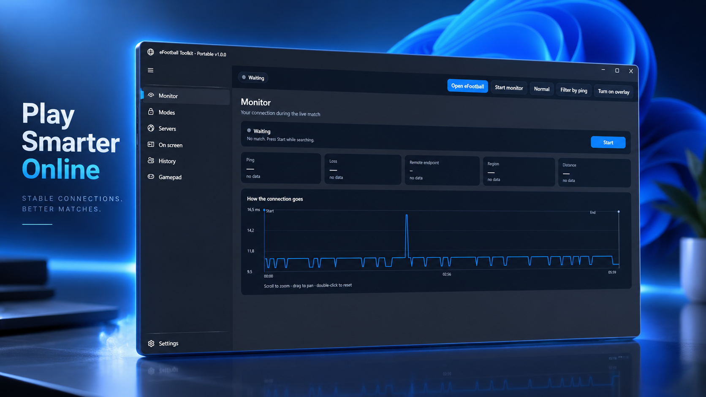
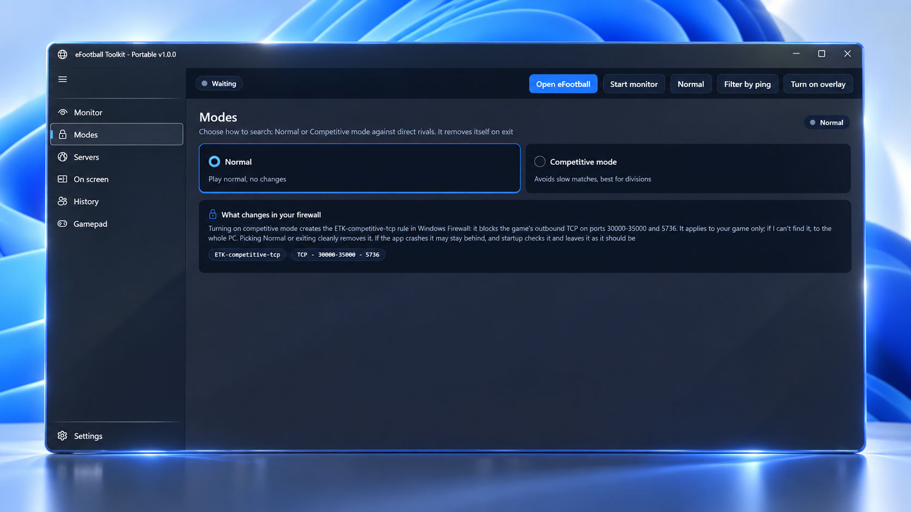
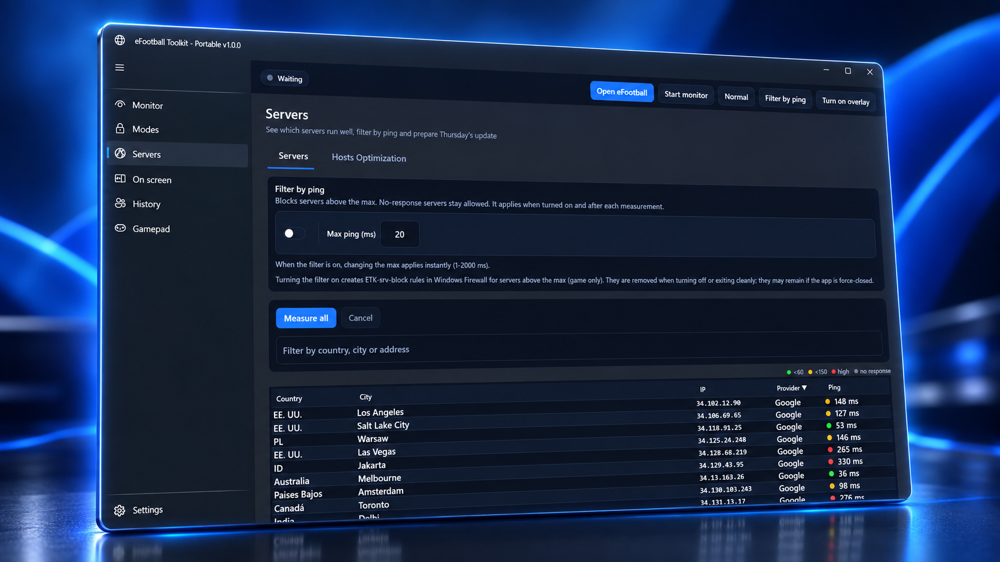
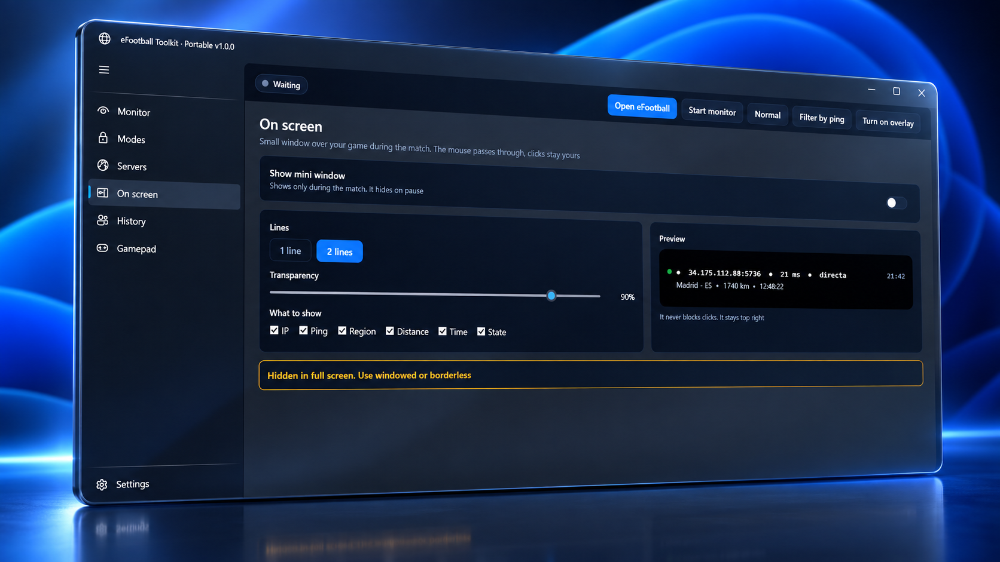
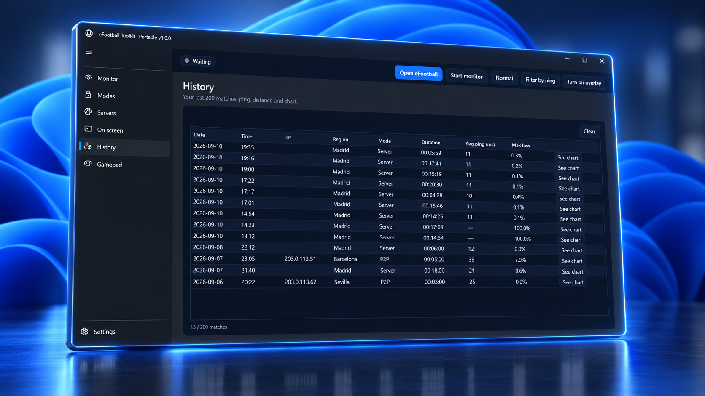
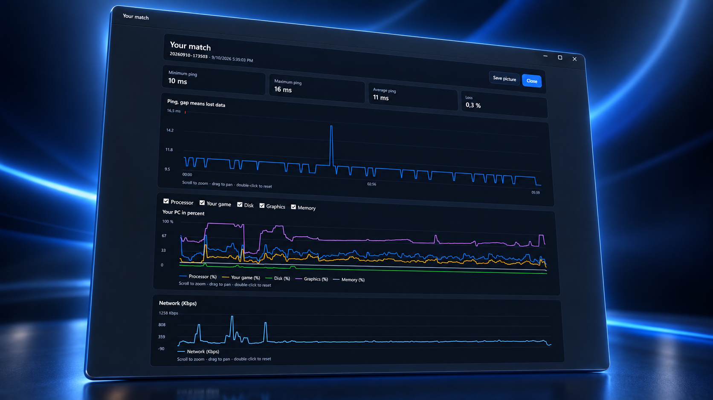

<div align="center">

# eFootball Toolkit Portable

**Deja de adivinar tu conexión. Mírala en vivo y actúa.**

Diagnóstico portable para eFootball en Windows: P2P o servidor, ping real, modos de red, servidores, overlay, rivales, mando — sin instalación.

[](https://github.com/AlejOcana/efootball-toolkit-portable/releases)
[](https://github.com/AlejOcana/efootball-toolkit-portable/releases)
[](EULA-binaria.md)

[**Descargar la última versión**](https://github.com/AlejOcana/efootball-toolkit-portable/releases) · [**Invítame a un café en Ko-fi**](https://ko-fi.com/alejandroocanagarcia)

_Sin instalación. Descomprime y ejecuta._

</div>

> Distribución binaria. Los ZIP publicados en [Versiones](https://github.com/AlejOcana/efootball-toolkit-portable/releases) se rigen por [EULA-binaria.md](EULA-binaria.md), no por la LICENSE MIT de este repo (esa LICENSE cubre solo los textos, documentos y scripts de este repo). Los componentes de terceros están listados en [THIRD-PARTY-NOTICES.txt](THIRD-PARTY-NOTICES.txt).

## Qué es

Aplicación de escritorio (WPF, .NET Framework 4.8, incluido en Windows 10/11) con interfaz Fluent oscura: 7 pestañas (Monitor, Modos, Servidores, Overlay, Rivales, Mando, Ajustes) más tira de overlay en vivo sobre el juego (`OverlayWindow`), ventana de detalle de partido e icono de bandeja. Etiquetas en ES y EN, cambiables sin reinicio.

Proyecto independiente, sin afiliación con KONAMI. Uso nominativo de eFootball.

### Recorrido

| Zona | Qué obtienes |
|------|--------------|
| **Monitor** | Tipo de conexión en vivo (P2P / `SERVIDOR_UDP`), IP local, IP del servidor, IP del rival, endpoint confirmado, protocolo, ping real por tcping e ICMP, región aproximada por GeoIP local, eventos y conexiones actuales. Ámbito: UDP de eFootball `30000-35000` + `5736`. |
| **Modos** | Competitive (bloquea el TCP propenso a lag), COOP (competitive más bloqueo de rangos UDP problemáticos), NORMAL (solo monitor). Ámbito: solo eFootball, sistema entero o sin reglas. Todas las reglas usan el prefijo `ETK-*` y se revierten con un clic. |
| **Servidores** | Lista por país e IP con latencia real (probar todos, por país o uno a uno), alta de IPv4 e IPv6, permitir y bloquear, más catálogo automático de IP nuevas observadas. Incluye trato regional (países preferidos frente al resto durante la búsqueda) con lista pendiente y lógica Thursday. Sin pestaña aparte. |
| **Overlay** | Tira compacta de 1-2 líneas sobre el juego (estado, modo, ping, región, endpoint, hora), opacidad configurable, botón Marcar IP. |
| **Rivales** | Historial local de partidos (límite 200), alerta visual y sonora ante reencuentro, bloqueos actuales. |
| **Mando** | Botones en vivo, gatillos LT y RT, sticks, frecuencia de muestreo, batería y estado de vibración (XInput incluido en Windows; Xbox funciona de serie, PlayStation mediante DS4Windows). |
| **Ajustes** | Lanzador que detecta la instalación de Steam y XboxPC, inicia el juego con prioridad alta y muestra sus conexiones actuales. Portable estricto: todo vive junto al exe (`data/`, `config/`, `logs/`), nada en el registro. |

## Capturas

Cómo se ve la app:


*Monitor — en espera de partido, con la gráfica de ping en vivo.*


*Modos — Normal frente a Competitive, con el aviso de firewall.*


*Servidores — filtro por ping y la lista medida.*


*En pantalla — ajustes del overlay con vista previa.*


*Historial — últimos partidos con ping y pérdida.*


*Tu partido — gráficas de ping, carga del PC y red.*

## Requisitos

- Windows 10/11 x64.
- Derechos de administrador para capturar tráfico y aplicar bloqueos.
- Red por cable, sin VPN ni proxy, para validar partidos en vivo.
- Npcap como pieza externa, nunca incluida (descargar desde https://npcap.com/#download), para la captura de paquetes.
- Los ficheros del driver WinDivert (`WinDivert.dll` / `WinDivert*.sys`) se incluyen sin modificar junto al exe cuando están presentes en la salida de compilación (deben quedarse ahí porque `LoadLibrary` ignora el probing). Ver [THIRD-PARTY-NOTICES.txt](THIRD-PARTY-NOTICES.txt).

<details>
<summary>¿Sin derechos de administrador?</summary>

Si deniegas el aviso de UAC, la app muestra una vez el aviso de modo limitado y sigue con lectura parcial. Nunca se detiene con un error fatal.

</details>

<details>
<summary>¿Carpeta protegida contra escritura?</summary>

Cuando la carpeta del exe no permite escribir, el estado recurre a `%LocalAppData%/EtkPortable`. Para un uso portable pleno, usa una carpeta propia.

</details>

## Instalación

1. Descarga el ZIP desde [Versiones](https://github.com/AlejOcana/efootball-toolkit-portable/releases) y descomprímelo en una ruta corta sin caracteres raros.
2. Doble clic en `EtkPortable.exe` — clic derecho y **Ejecutar como administrador** para capturar tráfico y aplicar bloqueos. Si deniegas el UAC tienes modo limitado una vez y la app sigue con lectura parcial.
3. Abre la app y pulsa Iniciar mientras eFootball busca partido.
4. Aplica competitive con ámbito solo eFootball, prueba servidores, marca rivales, revisa el mando.
5. Al terminar pulsa Limpiar `ETK-*`. Las reglas son temporales y la limpieza también corre al salir.

<details>
<summary>¿ZIP viejos y ficheros lanzadores?</summary>

No se incluye ningún script lanzador. Borra `INICIAR.bat` si viene dentro de ZIP viejos.

</details>

## Verificar la descarga

Cada versión incluye `EtkPortable-wpf-win64.zip` más su fichero `.sha256`. Compara:

```powershell
Get-FileHash *.zip -Algorithm SHA256
```

El hash debe coincidir con el `.sha256` publicado junto al ZIP en la página de [Versiones](https://github.com/AlejOcana/efootball-toolkit-portable/releases). Ver la lista completa en [docs/VERIFY.md](docs/VERIFY.md).

## Firewall

La app crea y borra solo reglas llamadas `ETK-*` (prefijo `ETK`). La limpieza corre al salir y ante un cierre inesperado.

<details>
<summary>Limpieza manual (PowerShell como administrador)</summary>

```powershell
powershell -ExecutionPolicy Bypass -File scripts\cleanup-etk.ps1
```

Comprueba después que no quede nada:

```powershell
netsh advfirewall firewall show rule name=all | Select-String "ETK-"
```

</details>

## Mediciones honestas

El ping y la región nunca se inventan: los hosts que no responden muestran `-1` y vacío más etiqueta "sin respuesta". GeoIP es aproximación con caché editable.

Atribución obligatoria: This product uses the IP2Location LITE database for IP geolocation (datos de https://lite.ip2location.com, usados bajo su licencia LITE).

## Créditos

Gracias al equipo XJBT del ejemplo ([SuNingXJBT/efootball-toolkits](https://github.com/SuNingXJBT/efootball-toolkits), [Network_Monitor_Tool](https://github.com/SuNingXJBT/eFootball_Network_Monitor_Tool), [Block_TCP_Matches](https://github.com/SuNingXJBT/eFootball_Block_TCP_Matches), [t.me/eFootballxjbt](https://t.me/eFootballxjbt)) cuyos documentos públicos de referencia y comportamiento observable (`isPSPmsg` / `isp2pmsg`, perfil `XjbtReference2026` 2026-09-07 `0x8261` len76) ayudaron a construir esta herramienta. No se redistribuye aquí su código ni sus binarios.

## Licencia y documentos

- Textos, documentos y scripts de este repo: MIT, ver [LICENSE](LICENSE).
- Binarios descargables (ZIP): [EULA-binaria.md](EULA-binaria.md).
- Avisos de terceros: [THIRD-PARTY-NOTICES.txt](THIRD-PARTY-NOTICES.txt).
- Política de seguridad: [SECURITY.md](SECURITY.md).
- Cambios: [CHANGELOG-0.1.md](CHANGELOG-0.1.md).
- Lista de verificación: [docs/VERIFY.md](docs/VERIFY.md).

---

Si te ahorra disgustos en matchmaking: [Invítame a un café en Ko-fi](https://ko-fi.com/alejandroocanagarcia).
